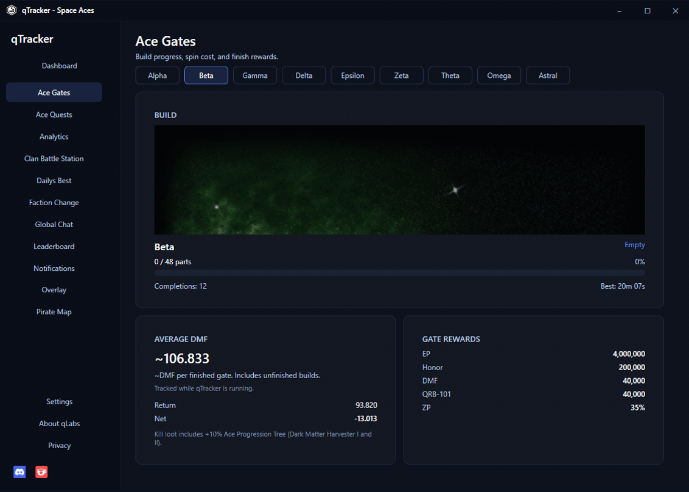

# qTracker - Space Aces

HUD and session tracker for Space Aces. Shows your pilot stats from the **official Space Aces website** while you play. No screen OCR, no memory access, no injection, no game files modified.

Made by **[Qinaii Labs](https://qinaii.de)**

## Download

**[Latest release](https://github.com/Qinaii/qtracker-spaceaces/releases/latest)** · Windows 10/11 · `qtracker_v2.1.1.exe`

Log into Space Aces on this PC via the **Steam client** or a **browser** (Chrome, Edge, Brave, Firefox, Opera, …). Each release includes a `qtracker_vX.Y.Z.sha256` checksum file. Compare it to the file you downloaded before running.

## Quick start

1. Download and run `qtracker_v2.1.1.exe` from Releases
2. Log into Space Aces on this PC (Steam client or browser)
3. Open **Dashboard** and click **Start** to begin session tracking
4. Optional: open **Overlay** and click **Activate Overlay** for an always-on-top HUD
5. Optional: in **Settings**, enable **Start qTracker when Space Aces launches** (Steam client)
6. Optional: open **Notifications** for Ace Quests, Pirate Map, and CBS toasts

If status shows an error, click **Retry** after you are logged in. Settings shows which session is active (Steam / browser). If Steam and a browser are both logged in, Steam wins.

## Features

| Area | What you get |
|------|----------------|
| **Dashboard** | Account (pilot, level, rank, ship), live DMF / EP / Credits / Honor, session deltas, DMF/h, Start / Pause / Reset Hud |
| **Overlay** | Always-on-top logo + stats panel; click-through rows; drag logo; right-click menu; farming goal with ETA; height shrinks when rows are off |
| **Ace Gates** | Live gate progress and parts, average DMF, finish rewards |
| **Ace Quests** | Active Quests, Ace Pass tasks, All Quests with search; task progress, ship lock, target, and map |
| **Analytics** | Mob kills, resources (ores / bonus boxes), DMF spend from your pilot log |
| **Dailys Best** | Daily top gains by date (leaderboard snapshot) |
| **Leaderboard** | Ranking, Events, Clans, Gates; faction and rank icons; Pilot Lookup by leaderboard alias |
| **Faction Change** | Recent faction switches from the world feed |
| **Pirate Map** | Open / energy / timer when the world feed has data |
| **Clan Battle Station** | Live Free / occupied CBS slots by map, clan tag, construction timer |
| **Global Chat** | Recent public chat from the world feed |
| **Notifications** | Desktop toasts for Ace Quests, Pirate Map, and CBS; sound, volume, duration 5 to 30 s; per-category toggles; quest rewards with icons |
| **Settings** | Connection status, Retry, diagnostics log, optional auto-start with Space Aces |
| **About / Privacy** | Updates check, Qinaii Labs links, privacy policy and terms |

Tracked stats: **Dark Matter Fragment (DMF)**, **EP (XP)**, **Credits**, **Honor**, **Level**.

### Overlay quick guide

- **Click logo:** show or hide stats
- **Hold logo:** drag overlay
- **Right-click logo:** Start, Pause, Reset Hud, Dashboard, Check for Updates, Exit
- **Logo color:** blue = idle, green = running, orange = paused, red = connection error
- Configure visible rows and the farming goal under **Overlay** in the sidebar

### Notifications quick guide

- Master enable and duration (5 to 30 seconds) under **General**
- **Ace Quests:** quest complete, optional rewards with icons, optional task complete on multi-task quests
- **Pirate Map:** open / closing soon / closed
- **CBS:** build (under construction), spawn finished, destroyed
- Toasts appear top-center and are click-through (same idea as the HUD stats panel)
- Preview sound and send a test toast from the Notifications page
- Discord and Ko-fi are in the sidebar under Settings / About / Privacy

## Requirements

- Windows 10 or 11 (64-bit)
- Space Aces login on this PC: Steam client **or** browser (same website session)
- Internet access for Space Aces services (leaderboards and world feed may use the Qinaii cache)

## Data and privacy

All config and history stay on your PC:

`%APPDATA%\qTracker\`

qTracker uses your local Space Aces login session (Steam client or browser profile on this PC) to show your own stats. Leaderboard lists and world-feed pages (Dailys Best, Faction Change, Pirate Map, CBS, Global Chat) may go through the Qinaii cache so the game API is not overloaded. Nothing is sent to Qinaii Labs for analytics, advertising, or resale.

See **Privacy** in the app for policy and terms.

## Troubleshooting

| Problem | Try this |
|---------|----------|
| Connection error | Log into Space Aces (Steam or browser), then **Retry** in Settings |
| Stats stay `n/a` | Wait a few seconds after login |
| Wrong account (Steam vs browser) | Steam wins when both are logged in; log out of the Steam client to use a browser session |
| Overlay missing | **Overlay** tab → **Activate Overlay** |
| Analytics empty | Play with tracking running; data fills from the pilot log |
| World pages empty | Check internet; those tabs use the Qinaii world feed |
| No notification toast | Enable notifications plus the matching Ace Quests / Pirate Map / CBS option; volume not muted |
| Second window warning | Only one qTracker instance is allowed |

## Support

- **[Report a bug](https://github.com/Qinaii/qtracker-spaceaces/issues/new/choose)**
- **[Qinaii Labs](https://qinaii.de)** · **[Discord](https://discord.gg/9wD5Tgxpr9)**
- Optional: **[Ko-fi](https://ko-fi.com/qinaiilabs)**

## Other Qinaii Labs tools

- **[Qiana](https://qiana.dev)** - Discord bot with web dashboard
- **[qUtils](https://qinaii.de)** - Windows utility suite

## License

Distributed as a free binary release. Source code is not public.
